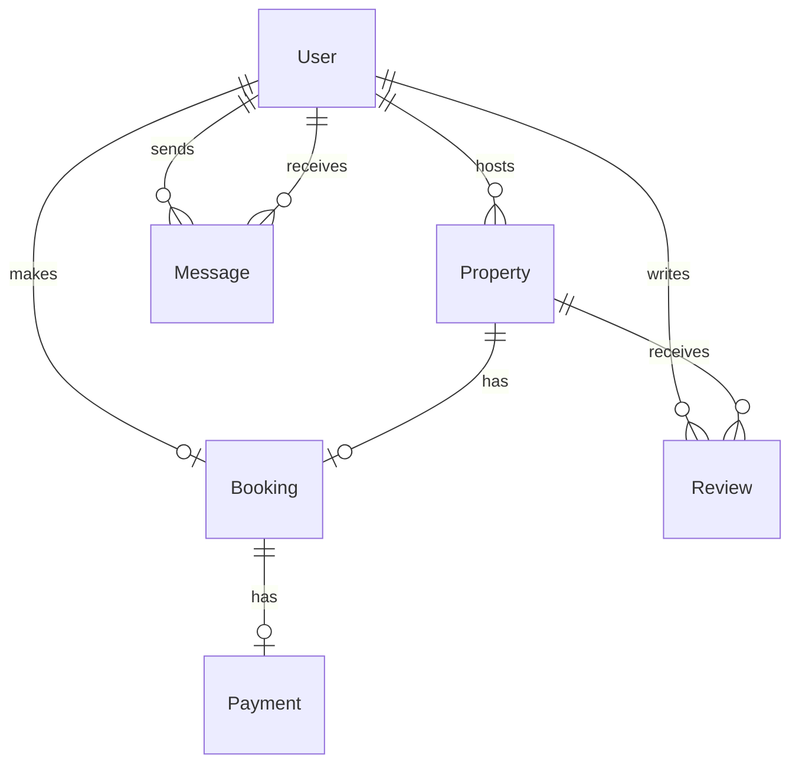

# Airbnb Database Schema

This repository contains a complete, production-ready SQL schema for a vacation rental platform, similar to that of Airbnb. The schema is designed for PostgreSQL and includes tables for users, properties, bookings, payments, reviews, and messaging.

The primary script, `schema.sql`, is **idempotent**, meaning it can be run multiple times without causing errors. It will safely drop all existing objects and recreate them from scratch, making it ideal for development and testing environments.

## Schema Overview

The database is composed of the following core entities:

- **User**: Stores user information, including their role (guest, host, admin).
- **Property**: Contains details about rental properties, linked to a host (a User).
- **Booking**: Manages reservations made by users for specific properties.
- **Payment**: Tracks payments associated with each booking.
- **Review**: Allows users to leave ratings and comments for properties they've booked.
- **Message**: Enables direct communication between users.

### Entity-Relationship Diagram (ERD)

The diagram below illustrates the relationships between the tables in the schema.



---

## How to Use This Schema

### Prerequisites

- An active PostgreSQL server.
- A SQL client like `psql`, DBeaver, or Postico.

### Instructions

1.  **Create a new database** (if you don't have one already).

    ```sql
    CREATE DATABASE airbnb_dev;
    ```

2.  **Connect to your new database** using your SQL client.

3.  **Run the `schema.sql` script.** This single command will set up everything: types, tables, triggers, and indexes.

    If using `psql` from the command line:

    ```bash
    psql -d airbnb_dev -f schema.sql
    ```

    If using a GUI client, simply open the `schema.sql` file and execute the entire script.

You can re-run the script at any time to reset your database to a clean, fresh state.
